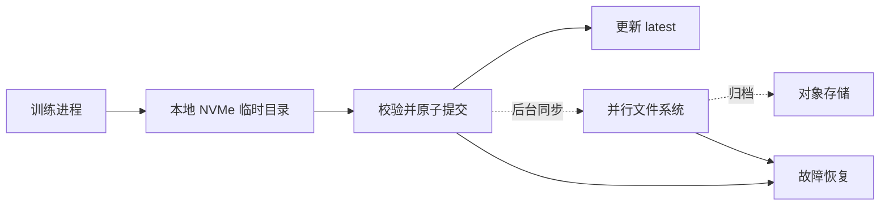

# 训练 Checkpoint 该放哪：本地 NVMe、并行文件系统与对象存储

Spot GPU 再便宜，也得先保证训练能恢复。任务被回收以后，如果最新的 Checkpoint 只留在失联节点上，或者远端只有一份没写完的半成品，前面省下来的机器钱很快就会变成重复训练的时间。

Checkpoint 往往要经过训练进程、节点本地盘、共享存储和归档系统。每一段路径的速度和用途都不一样。把它们当成几块可以随意替换的盘，保存时容易拖慢训练，出故障后也未必读得回来。

比较稳妥的做法，是把它们排成一条写入链路：本地 NVMe 接住训练进程，并行文件系统保存集群可见的恢复副本，对象存储负责长期归档。

## 对象存储应该待在链路末端

直接把训练 Checkpoint 写进对象存储，看起来最省事。可训练过程更在意保存期间要停多久，以及故障后多久能重新跑出第一个有效 step。

对象存储的读写路径更长。大文件通常还要走 multipart upload，任意一次瞬时失败都可能留下一次没有完成的上传。训练进程若同步等待这条路径，保存时间会直接算进训练时间；恢复时再从对象存储把大文件拉回来，启动也会被拖慢。

对象存储仍然有位置。历史版本、模型归档和日志备份都可以放在这里，但它不该直接站在训练进程后面。送到对象存储的，应该是已经在前两层落稳并完成校验的副本。

## 三层存储各做一件事

本地 NVMe 是热层。节点本地读写速度可以达到 5 至 7 GB/s。它离训练进程最近，适合先接住当前 Checkpoint，也适合作为原节点上的第一恢复来源。它要做的是尽快结束训练侧的同步等待，长期保存交给后面的存储层。

并行文件系统是温层，常见方案有 Lustre、GPFS、BeeGFS 和 DAOS。它给多个训练节点提供同一套目录，聚合带宽可以做到数百 GB/s，适合收拢分片 Checkpoint，并保存集群范围内可见的恢复版本。这个数字是整个存储集群的聚合能力，不能和单节点 NVMe 的顺序读写速度直接比较。

对象存储是冷层，S3、OSS、MinIO、Ceph 都属于这一类。它便宜、容量大，适合放历史 Checkpoint，但不承担训练热路径。



多存副本只是结果，分层的目的其实是把三种压力拆开。本地盘缩短保存暂停，共享存储保证换节点后还能恢复，对象存储则负责长期保留。

## 写完了，不等于能恢复

明确报错反而好处理。麻烦的是目录已经出现，看起来像是写成功了，里面却少了几个 shard。恢复脚本如果只判断目录是否存在，迟早会读到这种半成品。

更安全的提交顺序是：

```text
写入 path.tmp-<uuid>
    -> 所有 shard 完成
    -> 写入并校验 manifest
    -> rename 为 step-XXXXXXXXX
    -> 更新 latest
```

临时目录不能进入恢复候选。`manifest.json` 记录每个 shard 的路径、字节数和 sha256，恢复前先照着清单检查。`latest` 也不能在第一个文件写完时就更新，只有整个版本通过校验，它才能指向新的 step。

在本地 NVMe 和并行文件系统这类 POSIX 文件系统上，可以利用 rename 做原子提交。同步到对象存储时，则要等 multipart upload 完整结束，再把这一版标记为可归档、可恢复的版本。上传了一半的目录无论看起来多完整，都不能算数。

异步同步也要有节制。上一轮 Checkpoint 还没同步完，下一轮又开始抢本地盘、网络和后台 buffer，训练抖动往往比同步保存更难排查。最简单的约束是只允许一个后台同步任务在途，新一轮开始前先确认上一轮已经收尾。

## Spot GPU 能不能用，要看恢复链路

Spot GPU 适合可以中断、可以续跑，也能接受启动时间不确定的训练任务。主实例负责保底，Spot 实例补充可被回收的训练容量，这个组合比把所有任务都押在 Spot 上稳妥。

只写本地 NVMe 支撑不了这种中断方式。如果实例被回收时本地副本也不可用，恢复程序必须能从并行文件系统找到最近一份通过校验的版本。训练过程中可以先落本地盘，但后台同步不能长期欠账。

在线推理不适合这套玩法。请求正在进来时，实例突然消失，Checkpoint 并不能替你维持服务。对完成时间有硬要求的训练也不合适，因为中断何时发生、替代资源何时可用，都不是任务自己能控制的。

保存频率也不是越高越安全。写得太勤，Checkpoint 会不断占用 I/O 和内存；写得太稀，一次回收就会丢掉太多已经完成的 step。频率要结合单次保存耗时和任务能承受的重跑量来定，不存在一个对所有模型都正确的固定分钟数。

## 一套够用的最小方案

如果暂时不想引入复杂的 Checkpoint 服务，可以先把规则定死：

1. 训练进程只向本地 NVMe 的临时目录写入。
2. shard 全部完成并通过 manifest 校验后，再提交为正式版本。
3. 本地 NVMe 留最新副本，并行文件系统保存已经验证的恢复版本。
4. 历史版本从并行文件系统异步归档到对象存储。
5. `latest` 只指向通过校验的版本，Spot 任务从并行文件系统或已经预热的本地副本恢复。

先把这五条做对，比一开始就追求复杂的跨拓扑恢复更有用。训练真正被打断时，系统只需要回答一个朴素的问题：现在能读到的最新版本，究竟是不是一份完整的 Checkpoint。
